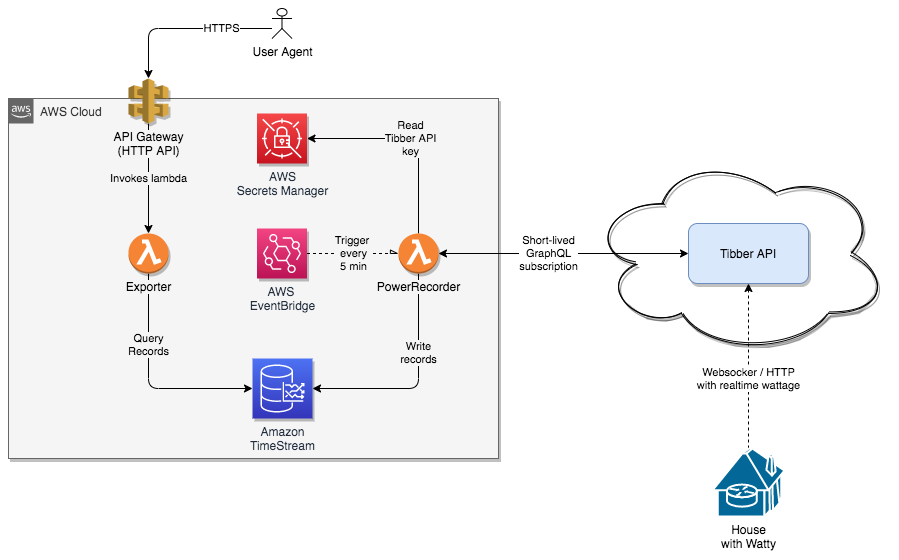

# Powertracker
Keeping track of electricity usage using AWS services, Tibber's API and the Watty energy monitor/load balancer.

_(example exported diagram)_
## Architecture


### AWS services
Uses the following services:
* AWS API Gateway
* AWS Lambda
* AWS EventBridge for scheduling
* AWS Timestream for time-series data
* AWS Secret Manager for storing Tibber API key

All lambdas are written in Golang.

AWS CDK is used for all provisioning, building the Go lambda's etc.

Change `cdk.json` in order to deploy either the powertracker or the chargerstatus stacks:

```json
"app": "npx ts-node --prefer-ts-exts bin/chargerstatus.ts",

or

"app": "npx ts-node --prefer-ts-exts bin/powertracker.ts.ts",
```

## CDK basics
This project was generated using 

The `cdk.json` file tells the CDK Toolkit how to execute your app.

## Useful commands

 * `npm run build`   compile typescript to js
 * `npm run watch`   watch for changes and compile
 * `npm run test`    perform the jest unit tests
 * `cdk deploy`      deploy this stack to your default AWS account/region
 * `cdk diff`        compare deployed stack with current state
 * `cdk synth`       emits the synthesized CloudFormation template
